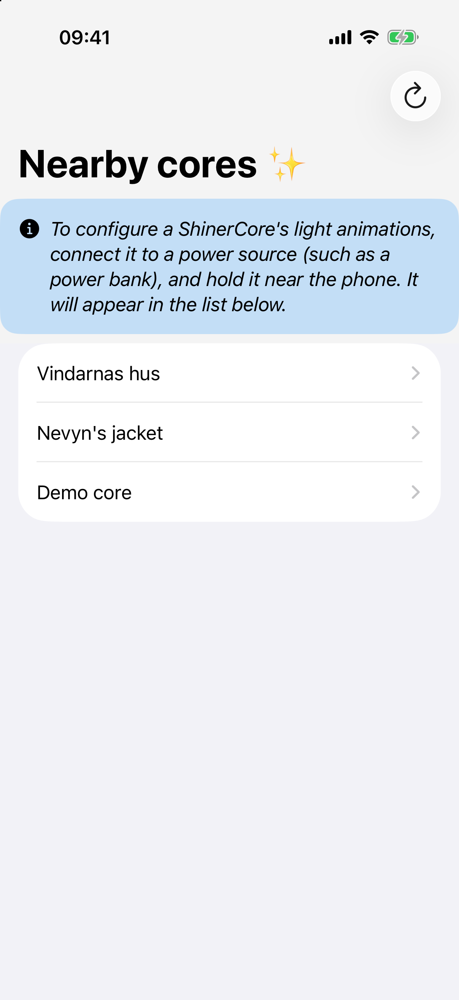
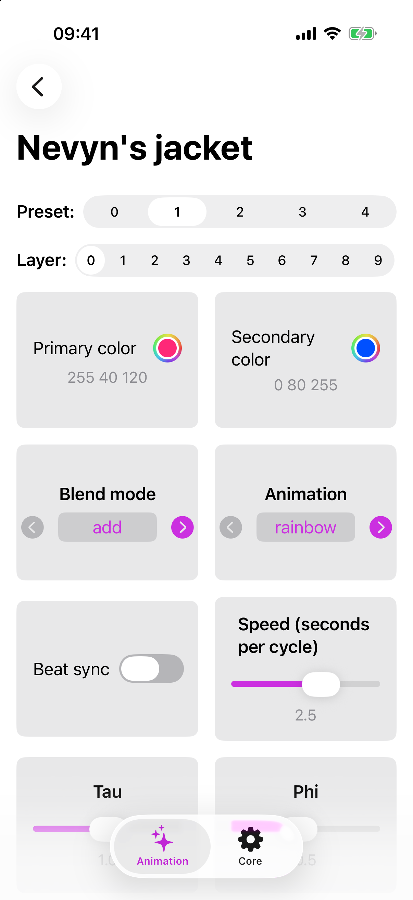
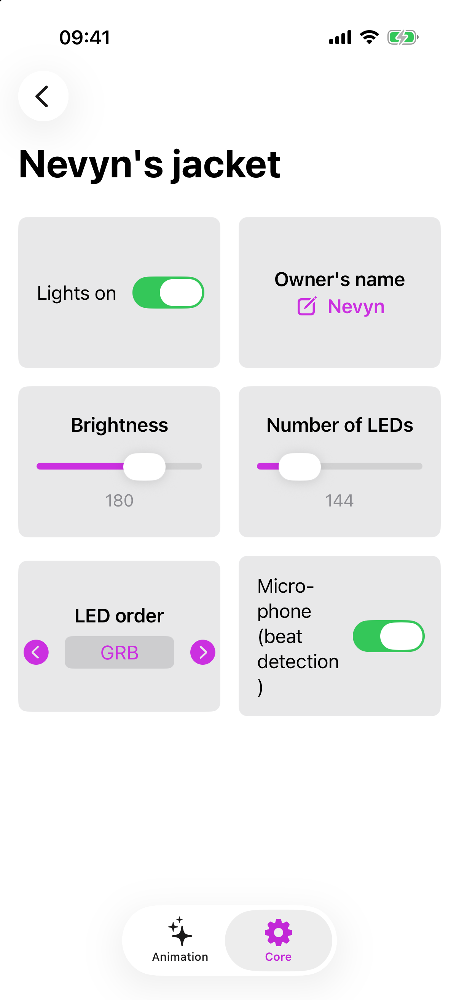

# ShinerCore Remote

This is the iOS companion app to [ShinerCore](https://github.com/nevyn/shinercore), an open source
firmware for ESP32 controllers to make pretty animations on addressable RGB LED strips 
(such as NeoPixel strips).

This app lets you configure a ShinerCore device over Bluetooth, changing animation patterns, colors,
speeds, etcetra.

  

